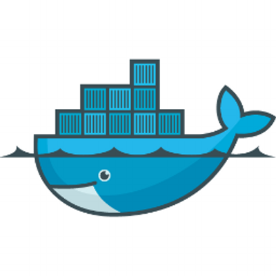

I started teaching myself [Docker](https://www.docker.com) during my time off December 2016.  I grabbed my Ubuntu laptop, loaded up Docker and got to work.  Docker is really easy to pick up and get started with.  I even loaded it up and build a few containers for a Raspberry [Pi](https://hub.docker.com/r/brettski/rpi-influxdb/).  :)

With Windows 10 and Windows Server 2016, Windows containers are now available.  You can get a base Windows container from [Docker hub](https://hub.docker.com/) and run it from one of these OS's.  Be forewarned, the images made from Windows Core are 10GB in size!  So much for being light. At least you only need to download them once.

I have and old (unfinished) ASP.NET MVC site running at http://brettski.com.  I figured this would be a good candidate to throw in a container since it has no external dependencies, like databases, etc.  It runs on ASP.NET MVC 3 or 4 and dotnet framework 3.5.

For windows base containers there are two bases I have seen from Microsoft: Windows Core and Windows Nano.  Since I haven't worked with Nano and understand it is really stripped down, I decided to start with Windows Core.

Since the site runs on IIS, I started with the Microsoft/IIS [container](https://hub.docker.com/r/microsoft/iis/). The container is a build of Windows Core with web server role added.   I started out with the following Dockerfile for my site which is located at the root of the solution.  I published the site to ./brettski4/pub/release/, so it may be easily mapped in the file.

#FROM microsoft/iis:latest

# copy compiled code into container
# build sent to /pub
RUN mkdir c:\\\\website
COPY .\\\\brettski4\\\\pub\\\\release c:\\\\website

WORKDIR c:\\\\website

# Add features
RUN powershell -Command Add-WindowsFeature -Name Web-Server; \\
 Add-WindowsFeature -Name Web-Asp-Net

# Add sites
RUN powershell -NoProfile -Command Import-Module IISAdministration; \\
 New-IISSite -Name "brettskicom" -PhysicalPath "c:\\website" -BindingInformation "\*:8088:"

EXPOSE 8088

ENTRYPOINT \["C:\\\\ServiceMonitor.exe", "w3svc"\]

It's a really simple Dockerfile. It starts by using the microsoft/iis:latest container image.  It then makes a directory in the container for the site files (c:\\\\website). Copies those files from the local machine into the container's new directory, and finally makes the workdir c:\\\\website, which isn't really needed for this container.

I needed to add two features to the container, ASP.NET application service and DotNet 3.5 (which isn't in the file above).  This is the first place I was tripped up as ASP.NET 3.5 cannot be loaded in this container, it's isn't an available option!  Either is Dotnet Framework 3.5.  An error is raised that the source files are not available.  I wasn't sure where to get them on the web, or what exactly was needed to add them (WSIM, etc.).

So sought out a different container.  Looking through the containers in the Microsoft Docker Hub listing I came across [microsoft/aspnet](https://hub.docker.com/r/microsoft/aspnet/).  Which is tagged for two versions: 3.5 and 4.6.2 (which has a few flavors). Going for the microsoft/aspnet:3.5 container image I updated my Dockerfile to add in web-server and asp.net application service.

FROM microsoft/dotnet-framework:3.5

# copy compiled code into container
# build sent to /pub
RUN mkdir c:\\\\website
COPY .\\\\brettski4\\\\pub\\\\release c:\\\\website

WORKDIR c:\\\\website

# Add features
RUN powershell -Command Add-WindowsFeature -Name Web-Server; \\
 Add-WindowsFeature -Name Web-Asp-Net45; \\
 Invoke-WebRequest -Uri "https://github.com/Microsoft/iis-docker/raw/master/windowsservercore/ServiceMonitor.exe" -Outfile "c:\\ServiceMonitor.exe"

# Add sites
RUN powershell -NoProfile -Command Import-Module IISAdministration; \\
 New-IISSite -Name "brettskicom" -PhysicalPath "c:\\website" -BindingInformation "\*:8088:"

EXPOSE 8088 

ENTRYPOINT \["C:\\\\ServiceMonitor.exe", "w3svc"\]

This Dockerfile starts out the same but is a bit different when adding features.  We add Web-Server, and ASP.NET 4.5.  Since this container didn't come with IIS, Microsoft didn't add the ServerMonitor.exe executable, I decided to grab it from the GitHub repo and save it in the container.

I am still not 100% sure what ServerMonitor.exe is used for, though it seems to keep the container active after it starts.  From what I have read, people had added useless loops written in powershell to have some type of process running at the start of the container. Running ServiceMonitor.exe while in the container only says, Usage: ServiceMonitor.exe \[service name\]. So little help there.

So this was my Tuesday, in between other things, getting something to work inside a Windows container.  If you haven't played with Docker yet, I strongly suggest that you do.  It is quite easy to get started with, and containerization is going to continue to grow as big if not bigger than Virtual Machines did.

The Container image built is in my Docker repository [here](https://hub.docker.com/r/brettski/brettskicom/).
