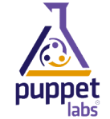

I have spent the last few months at work standardizing system builds and creating simple scripts and checklists to help maintain them.  As you may know this is a very labor-intensive way to go about things.  Its inability to scale is already showing strong even with the few dozen servers we manage.

Another pain point is the lower environments. The scripts are written for production.  Though I try to keep them as generic as possible, there are just things that aren't generic, like bound IP's.  So now that we are moving our standard build to all environments this is starting to shard our deployment processes.  Something I would like to avoid.

A logical step you may be screaming right now, is automation tools! Apply a deployment automation framework like Chef, Puppet or PowerShell DSC. I can't disagree, but time is _very_ limited and the first step toward a framework needs to be made carefully.

I knew from experience that automation will be needed, but I intentionally didn't start there as what exactly needed to be automated or to what level wasn't known. And for the most part this still isn't fully known--and that's okay.  That's why whenever approaching such targets you do so in small iterations (batches) and review your progress continuously.

Instead of starting out coding the configuration of my server I started with a checklist of everything which goes into it.  I assume if I was a seasoned Chef user (for example), I may start with a Recipe and start defining my server that way, but I am not a seasoned Chef user, or puppet, orPowerShell DSC, or super-automater-X. I am an administrator who still follows checklists and runs scripts to do much of my work, and I am drowning.  Time for the next step, time for an automation framework, but which to choose?

This is where the overwhelming part comes in as I try to determine which way to go in a world I know little about.  I understand the concepts and operation of these things, but I have no idea the effort required to implement one technology over the other, and which ones will work best in our environment.

Am I afraid to do some good old fashion research and testing?  No. I really don't think so.  Time is such a factor now and none of this is supported by my mangement.  I am doing this because I know it needs to be done.  They wont buy into it until they know its a sure thing (sigh).  I would hate to spend a week digging into a solution to determine that it doesn't work.  Well honestly, what is the problem with that?  It isn't like I will not learn from it either way, if the path is successful or not. What I would really like is to know which is the most logical way to go for a Windows platform. A pros and cons list may even be a good start, as long as its written neutrally.

Obviously PowerShell DSC is fully supported on windows. ;)  And the reading I have done on Chef and Puppet describes they support windows machines as well (Though neither list Server 2012).  PowerShell DSC is new and rough around the edges and both Chef an Puppet have been banged around for a while. But without learning each one and trying them out, how am I to know a logical path to go down.  Analysis paralysis anyone?

Have you gone down this path? Do you have some resources to suggest?
