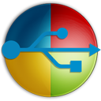

Back in June I purchased my first MacBook Pro.  A big move for someone who has run Microsoft systems for the last 30 years.  Sure I have used Linux and OpenBSD servers, Ubuntu workstation on old hardware, but my primary OS has primarily remained Microsoft--All this time until now.  Since June when I purchased my new MacBook Pro, I spend 90% of my time in OSX (not including at work).  The only reason I go to my Windows machine is for Visual Studio and a few games.  Yes a few games, as so many of them work under OSX.

One primary reason for purchasing the expensive MacBook Pro was to have it replace my primary desktop computer I have at home.  This is a self-built beast used for gaming, developing and pretty much anything else.  My first mistake was not putting up the $300 for the 1TB SSD.  The machine has a 512GB SSD and cutting it up with a Windows partition is just not enough space.  So know I need (want) to run an external drive to run Windows from.  With Thunderbolt and an SSD performance will not be an issue.

I scanned a few Internet articles to see if it was possible, saw that it  was and purchased an external 256GB Transcend thunderbolt/USB3.0 SSD. One Saturday I started the Bootcamp installation on the drive not knowing that it would consume most of that day.... I scanned those articles a bit too fast.

I put this post together to go over the steps to get an external Windows drive working.  There were so many hurdles along the way, I hope this helps someone.  I know I may need it again in the future.

## Setting up Windows 10 on an external SSD using Bootcamp

I say Windows 10, but this is useful for other Windows versions.

The firsts steps are the same as any other Bootcamp build to setup Windows on a Mac.  Though when you are done there will only be the OSX partition on your Mac drive proving all space to OSX.  Have your external drive connected to the machine.

1. Open Bootcamp and start the process.  When you are asked to partition your drive, just select the minimum size. 
2. Select install and the files will be copied and configured on the partition just created.  This will take a little bit of time. 
3. Once complete the machine will restart and boot into the windows OS installer.
4. Make sure you choose custom installation.
5. I recommend you delete all partitions from your external drive and select the unpartitioned space to be installed into. Obviously be careful not to delete OSX partitions!
6. The machine will boot a few times and everything will be fine, you'll be able to install software, reboot, etc.

The issue comes in when you go back to OSX. Using the Bootcamp icon in Windows notification area you select to go back to OSX.  No worries here, the computer will boot back to OSX without issue.  The problem is that you will not be able to get back into windows.  Going to Settings > startup disk  and selecting your external windows drive throws the error: "the bless tool was unable to set the current boot disk."  I still have not determine why apple can't mark the partition as bootable, though I assume it has to do with the fact it is external.

This is the point I wasted most of my time trying to get the drive to boot.  The issue is that the partition on the external drive is no longer marked active so it cannot be booted from.  Windows Diskpart will not mark an external drive partition as active.  My \[other\] partition tool use is a bit rusty and a few mistakes were made, so I hope to keep you from doing the same. Holding Alt (Option) at this point during the mac POST does not work as well, the drive is not bootable, so it is not provided as an option.

## The Fix

Ultimately I found a tool (yes this is a hack, but heck, it worked), [WinToUSB](http://www.easyuefi.com/wintousb) by EasyUEFI.  This tool quickly repaired the partition of the drive and made it bootable again.  No fuss, it just worked. Plus, you only need the free version to complete this as well.

The instructions for this is on their site which you can find here: [http://www.easyuefi.com/wintousb/faq/en_US/How-to-convert-Local-Disk-To-Windows-To-Go.html](http://www.easyuefi.com/wintousb/faq/en_US/How-to-convert-Local-Disk-To-Windows-To-Go.html)

Once I ran this against the drive I could boot from it!

## The drive is working, but booting to Windows is a little different then using Bootcamp

Once this process is complete you no longer use startup disk and Bootcamp to switch between OS's.  Your external drive will actually boot on ANY machine that supports booting from external storage devices.  Granted it has drivers loaded for the MacBook Pro so booting it on a different machine will not work so well (plus there may be issues with Windows 10 licensing since it uses a signature from your machine's hardware).

### Booting to Windows

When you start your Mac press and hold the alt (option) key.  This will bring up a boot menu which will show your Mac drive and your external Windows drive.  Choose the Windows drive and you are good to go!  Want to get back to Mac, reboot.  So, yes, you will need to this each time you want to boot to Windows, even if you choose restart.

## Cleaning Up

Once you have your new external drive working as described above go ahead back to Bootcamp Assistant and remove the Bootcamp partition.  It isn't needed and you can give that space back to your main OSX drive!  Hey, 32GB, that is a big chuck of music.  (:
