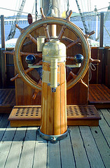

2013 is the first year ever that I setup an IDP (Individual Development Plan) for my employees.  That is any employees I have ever managed throughout my career.  I have to say when presented with the notion of having to do this, I questioned my ability to do it and its true worth.  Now into our first few months of the IDP, I have to say they are a good tool for learning more about your employees and helping them succeed in a direction they want to go.

As a manager the concept sounded like a good one to me.  I approached it as how I would like to construct an IDP with my manager.  The most important part to setting up an IDP is to take the first step to do it.  Yes, it is that simple, take the first step toward implementing them with your employees.

For me I did a small amount of reading to learn what they are.  Reviewed the companies intranet on the resources available to us, and called a meeting with my team.  No plan, no hard structure, just a direction and a desired outcome; to help develop an IDP of each of my employees.

At the meeting with my employees I explained about the IDP and that we will start putting these together on a one-on-one basis. Sure there were a lot of eye rolling, etc., but gratefully most everyone went back to their desks and put some thought behind where they want their career to go.

According to Wikipedia an [IDP](http://en.wikipedia.org/wiki/Individual_development_plan 'Individual Development Plan') is, "...a document completed by individual for the plan of self-development over the next period, usually one year."

Sounds pretty dry to me, but I guess it covers it. An IDP is a document of individual for the plan of self development. Though for the most part the document doesn't really mean much, its the process of creating the document that has all the impact.

Recall I said *most* employees went back to their desks to put some thought behind their careers.  There where a few who really doubted the IDP and considered it another corporate paper waste of time.  And it easily can be, and this is where I come in, to work hard with these employees to reveal some direction they want for their career.

After the initial meeting I called meetings with each employee.  The meetings where set for an hour, but I left a half hour of slack afterwards, just in case.  Since I was learning here as well, I wanted to ensure there was enough time to formulate a plan, or at least have a good start of one.  I didn't fully know what to expect.  The order I set the meetings was not random.  During the initial meeting and a short time after I paid attention to employees reaction to the IDP.  Since this is my first time doing this, I wanted to make sure that I had more willing participants in the beginning--their plans will be easier to put together and this will be a way to get a few under my belt before tackling the more difficult cases.

What happened during the first month was absolutely amazing to me; my employees were generally excited about their plan and what I was trying to do for them.  It made me excited.  I look forward to our next meetings to find out what they have learned and the progress made on their goals.

There are four steps in an IDP, create, capture, execute, reflect. It's a circular process, where creation occurs again after refection.

During creation the employee considers their strengths, development areas and short/long term career goals.  This information is captured and brought with them to the meetings with their manager.  It is amazing how difficult this step can be for some.  In a couple first meetings, I assisted the employee on focusing on future goals; what it is they want to do.  The focus here isn't what you may need to do to excel at your current position, but provide the skills required to keep you moving forward.  I found it helpful to remind the employee that this is not, in any way, part of the review process.  This plan is here strictly for them.  I am providing them an outlet to improve themselves and it is up to them to run with it.  I will help in any way I can, but obviously cannot do it for them.

The capture step is where the plan is finalized.  This is where I had very important conversations with employees about their future development and goals.  Some employees had a solid idea of where they wanted to go others had never given it a lot of thought.  For employees with solid ideas we set up goals for to move in this direction.  Where possible these goals were aligned with projects which could assist the company or our department.  In some cases we made up projects which would ultimately assist in some way, but most importantly provide all important focus to complete the tasks.  This is not always possible, and I feel this is okay too.  The goal is their development and if there are no correlating work withing the company I'm okay with that.

Execution is obvious, it is the work performed by the employee outlined in the IDP.  During this time we try to meet every-other-week to discuss progress, ask questions, and show off what progress has been done.  Much of this is one-on-one is the reflection step.  This is the step I am in with my employees currently.  I am finding to help keep some focused regular meetings are benefitial.  These aren't long meetings, I am not a meeting zealot.  We set aside thirty minutes every-other-week.  Sometimes we've used the time, other times it lasted ten minutes.

Reflection is the final step where the employee and manager use the IDP as a tool to discuss skill development on a regular basis.  Still being new to this process there hasn't been a lot of time spent on reflection yet.  There will be during the first quarter this year and I plan to fill in more details.  Some good questions for an employee to ask during this step are:

- What steps have I completed since our last discussion?
- What obstacles are preventing me from completing action steps or applying my new skill(s)?
- What else is required to bring me to my desired skill level?

For the employees there are three important question they should ask themselves:

- Does my manager know and support my short- and long-term career goals?
- Can I articulate how I will close critical development gaps and continue to build key strengths to achieve my goals?
- Have I improved at least one skill in the past three months?

If you have answered "no" to one or more of these questions it is likely you are not performing at your highest level, and may not be fully engaged within your role.  I found these three questions really important and a great way to understand my employees future desires and goals.  Working through the IDP provided great insight into these areas and taught me things about my employees that I never new.  I also believe it taught things to the employees that they didn't know about themselves.

To build a strong team, their needs to be communication and understanding.  I have found that the Individual Development Plan process is a great way to open new paths of communication and the future desires of employees.  If you are not paying attention to where an employee wants to go, they will most probably head out the door to find it.
