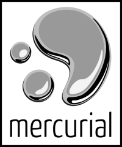

On and off for the last couple of months I have been learning Erlang.  My primary source for this is a decent booked named, "Learn You Some Erlang for Great Good!" (Fred Hebért, (c)2013 no starch press). What a great name, no starch press (:  I first found this tutorial online at [http://learnyousomeerlang.com/](http://learnyousomeerlang.com/).  The entire book is there, believe it or not.  I worked through the first few chapters and was hooked.  I decided to purchase the book to help pay for the work and for it to be more convenient to read.  But I digress, back to IIS & Mercurial.

The whole reason for the Erlang digression is that I was going through examples in the book on different computers.  After I was done with the session I would have copy my practice files back to my home server, which was a pain on a disconnected Linux box.  To solve this, I figured, why not setup a repo at home.  I have been wanting to do this for a while anyhow.  Now I could setup an SVN repo in a few minutes, but I don't really use SVN anymore ("It's so 1990's (:  ).  Mercurial is my DSCM of choice.  I have nothing against GIT, and do use it, I just regularly use Mercurial.

My home server is Microsoft Windows Home Server 2011.  Basically Windows 2008 R2 (IIS 7.5) with some other "stuff" thrown in.  Finding installations for a Mercurial server under Windows is not a simple task.  There are articles out there, most of them are old or incomplete.

This walk-through, [http://www.jeremyskinner.co.uk/mercurial-on-iis7/](http://www.jeremyskinner.co.uk/mercurial-on-iis7/) \[Jeremy's article\], is good and walks well through the process.  Unfortunately it is out of date and doesn't cover well what needs to be installed today to get this to work.  The first part of my pain as things weren't working.  I am thankful for its explanation of adding CGI support in IIS7, something I haven't needed to do in IIS7 before.  One thing this article mentions (in bold) is to use x86 installer of Python, even if your machine is 64-bit.  I believe this is no longer accurate as I installing 64-bit Mercurial and 64-bit Python and all is working fine.

For the start of my journey I was using this walk-through along with a few Mercurial wiki pages: [http://mercurial.selenic.com/wiki/HgWebDirStepByStep](http://mercurial.selenic.com/wiki/HgWebDirStepByStep) and [http://mercurial.selenic.com/wiki/PublishingRepositories](http://mercurial.selenic.com/wiki/PublishingRepositories).  I was understanding how the publishing works, but not getting things to work on my Windows server.  Mostly my error was around Python not being able to find hgweb stuff.  It was blowing up on application = hgweb(config), and said application undefined. The additional Mercurial installation I needed was located here: [http://mercurial.selenic.com/wiki/Download#Windows](http://mercurial.selenic.com/wiki/Download#Windows) which I found in a helpful wiki artical, [http://mercurial.selenic.com/wiki/HgWebInIisOnWindows](http://mercurial.selenic.com/wiki/HgWebInIisOnWindows).  If you follow this article straight through, you will almost have a successful installation.  What I learned from this page is that the Python module installer needs to be run.  This adds Mercurial modules to Python.  Something which is needed and not specified in the other installation instructions.

If you don't like the command line, the IIS configuration in the Mercurial wiki [article](http://mercurial.selenic.com/wiki/HgWebInIisOnWindows) is done through the command line.  You can reference how to do these through the UI using Jeremy's [article](http://www.jeremyskinner.co.uk/mercurial-on-iis7/).

My suggestion after going though this, this morning is to use both articles.  Read through them first, before installing anything, then plan your attack and go for it. Oh and yeah, you'll need to refer to the [Publishing Repositories](http://mercurial.selenic.com/wiki/PublishingRepositories) wiki page.

- "Setting up a Mercurial server under IIS7 on Windows Server 2008 R2"
    -  [http://www.jeremyskinner.co.uk/mercurial-on-iis7/](http://www.jeremyskinner.co.uk/mercurial-on-iis7/)
- "Configuring HgWeb in IIS on Windows"
    - [http://mercurial.selenic.com/wiki/HgWebInIisOnWindows](http://mercurial.selenic.com/wiki/HgWebInIisOnWindows)

A few things I learned from this morning's adventures

- Within the hgweb.config file the section **\[collections\]** is no longer needed, the section **\[paths\]** may be used instead.  There is more information around this here: [http://mercurial.selenic.com/wiki/PublishingRepositories](http://mercurial.selenic.com/wiki/PublishingRepositories)
- Within hgweb.config a path **of / = /path/to/repo/\*** will show (publish) all repositories.
- Withing hgweb.config using **allow\_push = \*** allows any user to push to the repository. Using this settings negates the need to enable authentication on the web.  Yes this makes things insecure, but my setup is internal to my house only.

So sure this took a bunch of hours to figure out and get working correctly.  Though now it is working correctly and I have my working Mercurial repository like I have been wanting for some time. Plus I have learned a bunch of stuff too.  Perhaps I'll go play a game now.
